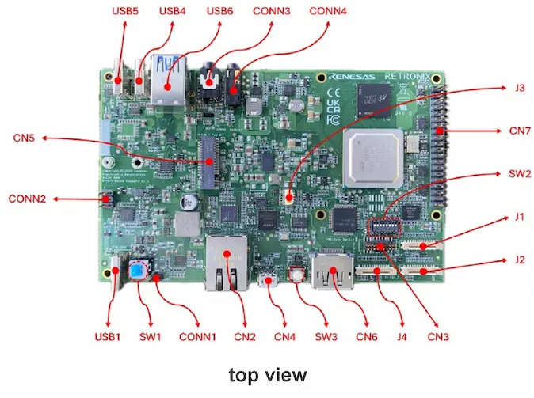
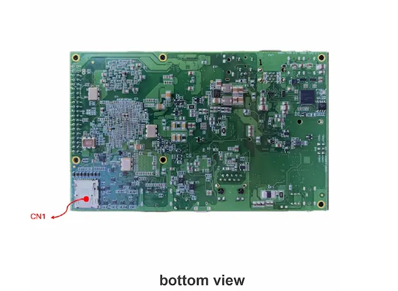

Contents
{: .contents}
0. Table of Content
{:toc}
{: .contents}

## Introduction

This is the page for Sparrow Hawk board with R-Car V4H provided Retronix Technology Inc.

## Hardware

### Information

|Board Name                   |Kit              |R-Car V4h SoC version|SoC Information      |Board Information                                                   |Where to Buy               |
|-----------------------------|-----------------|---------------------|---------------------|--------------------------------------------------------------------|---------------------------|
|Sparrow Hawk (DDR8GB/16GB)|Complete/Basic   |v3.0                 |[R-Car V4H][here.soc]|[Sparrow Hawk][here.product] provided by Retronix Technology Inc.|[Shimafuji][here.shimafuji]|

[here.soc]: <https://www.renesas.com/en/products/r-car-v4h>
[here.product]: <https://www.retronix.com.tw/en/product_sbc.html>
[here.shimafuji]: <http://www.shimafuji.co.jp/en/products/2207>

### Picture

### Features

| Function      | Interface        | Specification                            |
|---------------|------------------|------------------------------------------|
| CPU           | -                | 4x Arm® Cortex®-A76, 3x Arm® Cortex®-R52 |
| GPU           | -                | AXM-8-256                                |
| DRAM          | -                | 8GB/16GB LPDDR5                          |
| Flash Memory  | -                | 64MB QSPI                                |
| Camera I/F    | J1, J2           | 2x Raspberry Pi Camera                   |
| Display       | CN6, J4          | 1x DP, 1x DSI                            |
| Ethernet AVB  | CN2              | 1 Port (1Gbps)                           |
| Debug Serial  | CN4              | 2 Port                                   |
| Audio         | CONN3, CONN4     | In/Out, In                               |
| PCIe4.0       | CN5              | 1x M.2 Key-M (x2 lane)                   |
| USB3.0        | USB4, USB5, USB6 | 2x USB type-A, 2x USB type-C             |
| CAN-FD        | CONN2            | 2 Port                                   |
| PWM           | J3               | 1 Port                                   |
| JTAG          | CN3              | 1 Port                                   |
| Removal Media | CN1              | 1x MicroSD                               |
| Extensions    | CN7              | Raspberry Pi 40-Pin CN                   |
| Mode Switches | SW2              | Dip SW                                   |
| Power         | USB1(Input)      | USB PD 20V                               |
| Power Control | SW1, SW3, CONN1  | 2x SW, 1x Jumper                         |

### Switches Assignment

#### Boot mode

|SW2-1|SW2-2|SW2-3|Description                                     |
|-----|-----|-----|------------------------------------------------|
|ON   |ON   |ON   |Serial Flash boot at single read 40MHz using DMA|
|OFF  |OFF  |OFF  |SCIF/HSCIF download mode                        |

#### Other switch

|SW2-4|SW2-5|SW2-6|SW2-7|SW2-8|Description    |
|-----|-----|-----|-----|-----|---------------|
|OFF  |ON   |ON   |ON   |ON   |Initial setting|

Note: For more detail, please refer to board User's Manual.

### Debug Serial

This board has two serial devices and ChA(HSCIF0) is used for mainly.

|Channel                                                        |Baudrate  |Format|Flow Control|
|---------------------------------------------------------------|----------|------|------------|
|ChA(HSCIF0) ex) COM\<lower num\>, /dev/ttyUSB\<lower num\>  |921600 bps|8N1   |none        |
|ChB(HSCIF1) ex) COM\<higher num\>, /dev/ttyUSB\<higher num\>|115200 bps|8N1   |none        |

### Caution

FAN must be installed. Do not remove FAN for cooling the R-Car V4H from the board, as doing so will lead to the R-Car V4H being overheated to destruction. It is recommended to use a heat sink and FAN together.
{: .caution}

## Software Version List

|Software                   |Version|
|---------------------------|-------|
|Yocto Project              |5.0.14 |
|Debian                     |12     |
|Linux kernel               |6.12.58|
|U-Boot                     |2025.10|
|Arm Trusted Firmware       |2.14.0 |

## How to Startup

|BSP                       |
|--------------------------|
|[Yocto BSP][Yocto]        |
|[Debian based BSP][Debian]|

[Yocto]: <BSP/yocto_bsp.html>
[Debian]: <BSP/debian_based_bsp.html>

## Tips

1. There is no output on serial console when power on the board.
   * You can check following list to confirm board is broken or not.
      * Do you write the loaders into the board?
      * Do you change DIP-SW as correct settings?
      * Do you use correct serial device? This board has two serial devices and lower number is used for mainly.
      * Do you use correct USB-PD power supply? This board needs 20V3.25A(65W) output at least.

2. How to use HDMI display instead of DP display.
   * This board doesn’t support passive adaptor so that please use active adaptor.

3. Why my Headset Mic is not working?
   * There are two types of 4pin Headset. one is CIST which is default of sparrow-hawk. the other is MIST. The only deference is pin assign of MIC and GND. If you use MIST type of headset, please modify the board as follows:
      * Mount :R631 , R632
      * Unmount :R630 , R633

## Known Issues & Restrictions

1. USB Type-C port doesn’t support DP-alt mode so that Display output is not supported. Please use DisplayPort or Raspberry Pi touch Display 2 instead of type-c.
2. FAN/Heat sink less doesn’t work well due to high temperature in some case. Please attach the Heatsink and FAN to use the board.

## Support

FAQ: [https://github.com/orgs/rcar-community/discussions/categories/faq](https://github.com/orgs/rcar-community/discussions/categories/faq)

Q&A Forum: [https://github.com/orgs/rcar-community/discussions/categories/q-a](https://github.com/orgs/rcar-community/discussions/categories/q-a)
