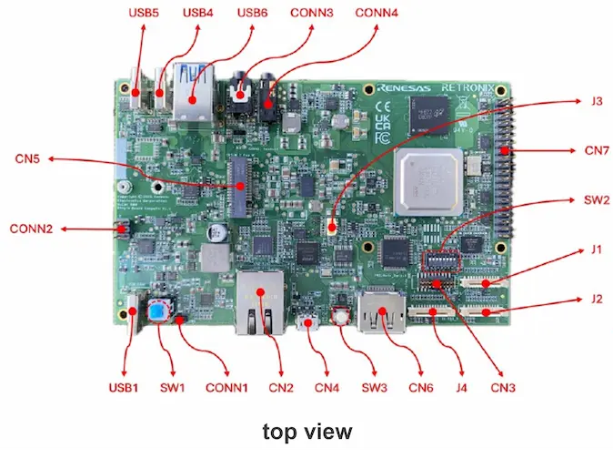
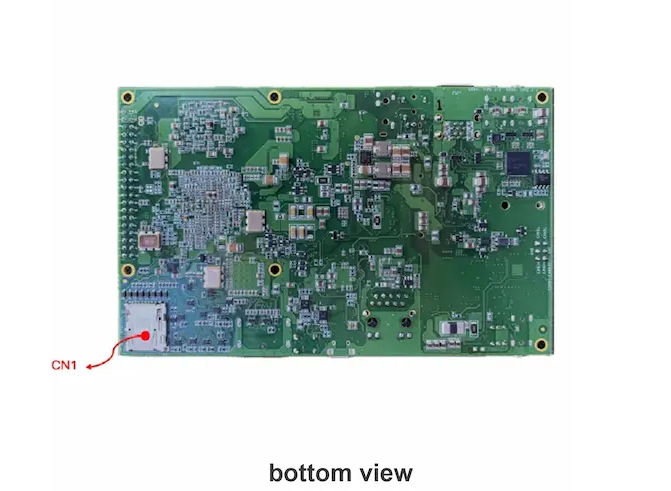

## Introduction

This is the page for Sparrow Hawk board with R-Car V4H provided Retronix Technology Inc.

&nbsp;

Sparrow Hawk is an evaluation board targeting the industrial market.

The supported software is only open source, with [Yocto BSP][Yocto] and [Debian based BSP][Debian].

Please post any inquiries regarding Sparrow Hawk on GitHub Discussions ([Q&A][Q&A]).

Note:
   * The secure boot feature provided by the R-Car V4H cannot be used on Sparrow Hawk due to hardware specification.
   * The Sparrow Hawk supports camera input via MIPI CSI only; therefore, automotive cameras such as GMSL cameras cannot be connected.
   * USB Type-C port doesn’t support DP-alt mode so that Display output is not supported. Please use DisplayPort or Raspberry Pi touch Display 2 instead of Type-C.

[Yocto]: <BSP/yocto_bsp.html>
[Debian]: <BSP/debian_based_bsp.html>
[Q&A]: <https://github.com/orgs/rcar-community/discussions/categories/q-a>

## What's New



## Hardware

### Information

|Board Name                   |Kit              |R-Car V4h SoC version|SoC Information      |Board Information                                                   |
|-----------------------------|-----------------|---------------------|---------------------|--------------------------------------------------------------------|
|Sparrow Hawk (DDR8GB/16GB)|Complete/Basic   |v3.0                 |[R-Car V4H][here.soc]|[Sparrow Hawk][here.product] provided by Retronix Technology Inc.|

[here.soc]: <https://www.renesas.com/en/products/r-car-v4h>
[here.product]: <https://www.retronix.com.tw/en/product_sbc.html>
[here.shimafuji]: <http://www.shimafuji.co.jp/en/products/2207>

### Board Connector Assignment



---




### Features

| Function      | Interface        | Specification                            |
|---------------|------------------|------------------------------------------|
| CPU           | -                | 4x Arm® Cortex®-A76, 3x Arm® Cortex®-R52 |
| GPU           | -                | IMG A-Series AXM-8-256                   |
| DRAM          | -                | 8GB/16GB LPDDR5                          |
| Flash Memory  | -                | 64MB QSPI                                |
| Camera I/F    | J1, J2           | 2x MIPI CSI Camera                       |
| Display       | CN6, J4          | 1x DP, 1x DSI                            |
| Ethernet AVB  | CN2              | 1 Port (1Gbps)                           |
| Debug Serial  | CN4              | 2 Port                                   |
| Audio         | CONN3, CONN4     | In/Out, In                               |
| PCIe4.0       | CN5              | 1x M.2 Key-M (x2 lane)                   |
| USB3.0        | USB4, USB5, USB6 | 2x USB type-A, 2x USB type-C             |
| CAN-FD        | CONN2            | 2 Port                                   |
| PWM           | J3               | 1 Port                                   |
| JTAG          | CN3              | 1 Port                                   |
| Removal Media | CN1              | 1x MicroSD                               |
| Extensions    | CN7              | Raspberry Pi® 40-Pin GPIO header          |
| Mode Switches | SW2              | Dip SW                                   |
| Power         | USB1(Input)      | USB PD 20V                               |
| Power Control | SW1, SW3, CONN1  | 2x SW, 1x Jumper                         |

### Switches Assignment

#### Boot mode

|SW2-1|SW2-2|SW2-3|Description                                     |
|-----|-----|-----|------------------------------------------------|
|ON   |ON   |ON   |Normal boot                                     |
|OFF  |OFF  |OFF  |Recovery mode boot                              |

#### Other switch

|SW2-4|SW2-5|SW2-6|SW2-7|SW2-8|Description    |
|-----|-----|-----|-----|-----|---------------|
|OFF  |ON   |ON   |ON   |ON   |Initial setting|

Note: For more detail, please refer to board User's Manual.

### Debug Serial

This board has two serial devices and ChA(HSCIF0) is used for mainly.

|Channel                                                        |Baudrate  |Format|Flow Control|
|---------------------------------------------------------------|----------|------|------------|
|ChA(HSCIF0) ex) COM\<lower num\>, /dev/ttyUSB\<lower num\>  |921600 bps|8N1   |none        |
|ChB(HSCIF1) ex) COM\<higher num\>, /dev/ttyUSB\<higher num\>|115200 bps|8N1   |none        |

For Windows users, if the console does not connect, please install the appropriate driver from the link below.

Link : [https://ftdichip.com/drivers/](https://ftdichip.com/drivers/)

### Caution

1. Hot! Do not touch R-Car V4H (main chip) directly. Fan must be installed to prevent R-Car V4H overheating and failure.
2. Do not touch the board while USB-PD is connected. Touch bare board may cause short circuit and failure.
3. Please use only a power supply and cable that comply with the USB Power Delivery (USB PD) standard. Using a non-USB PD power supply cause damage to the Sparrow Hawk.
{: .caution}

## Software Version List

|Software                   |Version|
|---------------------------|-------|
|Yocto Project              |5.0.16 |
|Debian                     |13     |
|Linux kernel               |6.18.20|
|U-Boot                     |2026.04|
|Arm Trusted Firmware       |2.14.0 |

## Select Software Platform

### [Yocto BSP][Yocto]

### [Debian based BSP][Debian]

[Yocto]: <BSP/yocto_bsp.html>
[Debian]: <BSP/debian_based_bsp.html>

## Tips

1. There is no output on serial console when power on the board.
   * You can check following list to confirm board is broken or not.
      * Do you write the loaders into the board?
      * Do you change DIP-SW as correct settings?
      * Do you use correct serial device? This board has two serial devices and lower number is used for mainly.
      * Do you use correct USB-PD power supply? This board needs 20V3.25A(65W) output at least.

2. How to use HDMI display instead of DP display.
   * This board doesn’t support passive adaptor so that please use active adaptor.

3. Why my Headset Mic is not working?
   * There are two types of 4pin Headset. one is CIST which is default of sparrow-hawk. the other is MIST. The only deference is pin assign of MIC and GND. If you use MIST type of headset, please modify the board as follows:
      * Mount :R631 , R632
      * Unmount :R630 , R633

4. Loader recovery procedure
   * If flashing fails and U-Boot no longer boots, please try the recovery procedure.
   * Download [ipl-burning.zip](https://github.com/rcar-community/meta-sparrow-hawk/releases/download/v2026-04-13/ipl-burning.zip) and unzip ipl-burning.zip. Then, run script in ipl-burning directory(Linux: run.sh, Windows: run.bat). If using Linux host PC, please install python3 and pip command on your system before running the script and close other console which uses serial port of the board before executing the script.
   1. Turn off the power and change SW2 according to the console instructions.
   2. Press Enter to continue.
   3. Turn on the power.
   4. Wait for the writing process to complete.
   5. Turn off the power and change SW2 again according to the console instructions.
   6. Press Enter to close the program.

   * Note:
      * This script use serial device /dev/ttyUSB* in Linux. But, it cannot be accessed from user without previledged right by default settings. Please use sudo command or add current user into dialout group.

   * Note:
      * Please change the Mode Switch(=SW2) according to the instructions displayed by the ipl-burning(run.sh or run.bat).

## Known Issues


