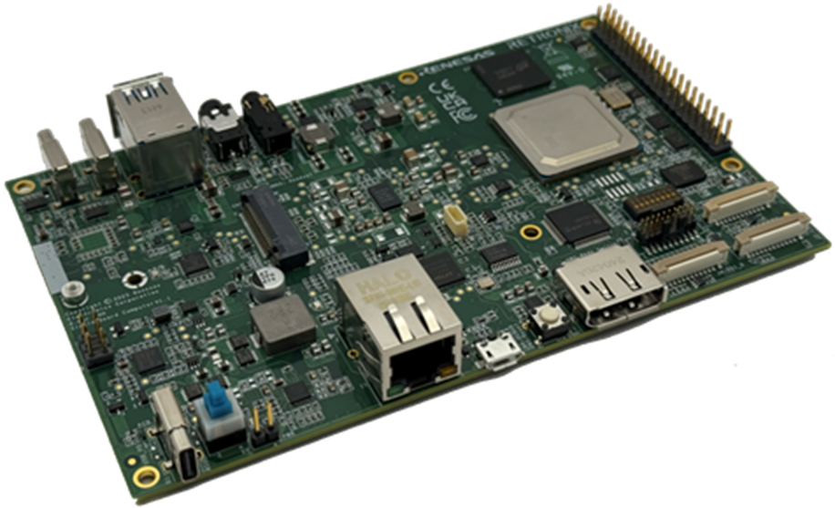

## Introduction

This is the TOP page of [R-Car Community](https://github.com/rcar-community).

## What's New

2025.08.07    We open the Home Page for Sparrow Hawk.

## Board List

 
**Sparrow Hawk** 
SoC: R-Car V4H
{: .img-list}

| Contents                                                            |
|---------------------------------------------------------------------|
| [Sparrow Hawk Board Page(retronix.com.tx)][Sparrow Hawk Board Page] |
| [R-Car V4H SoC Page(renesas.com)][R-Car V4H SoC Page]               |
| [Yocto BSP]                                                         |
| [Debian based BSP]                                                  |
| [FAQ(Github Discussions)][FAQ]                                      |
| [QA Forum(Github Discussions)][QA Forum]                            |
| Where to buy([Shimafuji])                                           |
{: .table-list}

 [Sparrow Hawk Board Page]: https://www.retronix.com.tw/en/product_sbc.html
 [R-Car V4H SoC Page]: https://www.renesas.com/en/products/r-car-v4h
 [Yocto BSP]: https://rcar-community.github.io/Sparrow-Hawk/index.html
 [Debian based BSP]: https://rcar-community.github.io/Sparrow-Hawk/index.html
 [FAQ]: https://github.com/orgs/rcar-community/discussions/categories/faq
 [QA Forum]: https://github.com/orgs/rcar-community/discussions/categories/q-a
 [Shimafuji]: http://www.shimafuji.co.jp/en/products/2207

